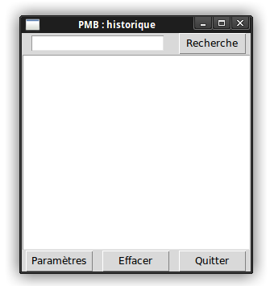
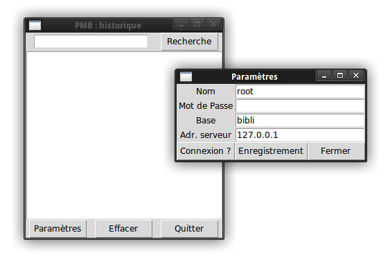

# PMBHistoire
__PMBHistoire__ est un logiciel permettant d'interroger l'historique des emprunteurs pour un exemplaire donné.<br/>
Il conviendra, au préalable de bien activer l'enregistrement des emprunts dans la configuration de PMB (cf. doc du logiciel.)

__PMBHistoire__ fonctionne avec les versions 3.X de Python et nécessite l'installation du driver MySQL de Oracle -> [téléchargement du driver](https://dev.mysql.com/downloads/connector/python/). <br/>
L'interface graphique repose sur TKinter : pas de soucis de portage !
### Installation :
- Clonez le dépôt.
- Décompressez l'archive.<br/>
- À la ligne de commande il suffit de taper :
```bash
python3 main.py
```
Autre possiblité : rendre exécutable _main.py_ en lui attribuant les droits d'exécution :
```bash
chmod +x main.py
```

### Au lancement :
Une fenêtre apparaitra :<br/>
<br/>
Il suffira d'entrer le numéro d'exemplaire puis de cliquer sur le bouton _"Recherche"_. <br/>Il est à noter que s'il on utilise un scanner/douchette laser, il n'y a rien à faire : seulement bien activer la zone de texte à la souris pour pouvoir y inscrire le numéro d'exemplaire. La douchette se chargeant de l'écriture et de simuler la touche _Entrée_.

### Configuration de la connexion :
Par défaut la configuration est très simple : c'est celle par défaut de PMB si vous n'avez rien modifié à l'installation de ce dernier.<br/>
<br/>
Il suffira de remplir les différentes zones de textes et de tester la connexion via le bouton _"Connexion ?"_. Il indiquera si les paramètres sont corrects. Et si les paramètres sont fonctionnels alors ils sont automatiquement modifiés, et l'utilisateur pourra effectuer ses recherches, sans effectuer d'enregistrement (cf. infra) ou sans avoir à relancer __PMBHistoire__.


Pour enregistrer les données : le bouton _"Enregistrement"_ fera son office. Il enregistre les données dans un fichier JSON simplissime, qui sera stocké dans le dossier où se trouve le logiciel, tout simplement. Pour des raisons de sécurité, il ne vaut mieux pas enregistrer le mot de passe car il sera écrit en clair dans le JSON.<br/>
Ce fichier JSON sera lu, _de facto_, s'il existe, à la prochaine utilisation du soft. Sinon ce seront les paramètres par défaut qui seront utilisés. Dès l'enregistrement, les données de connexion seront modifiées et utilisables par le système de recherche __PMBHistoire__.
